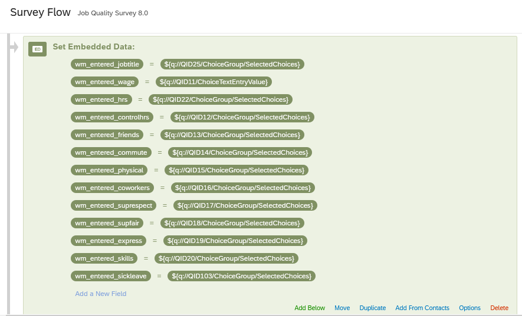
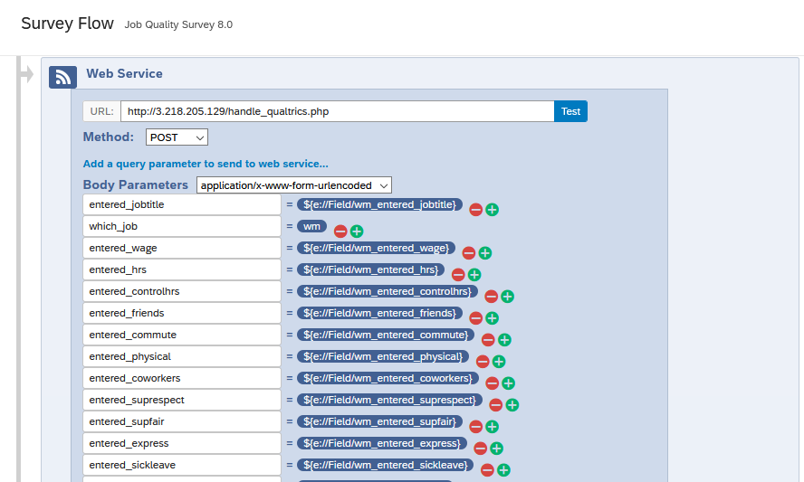
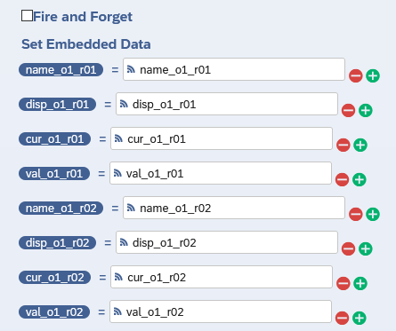
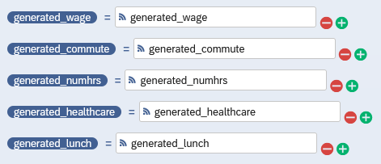
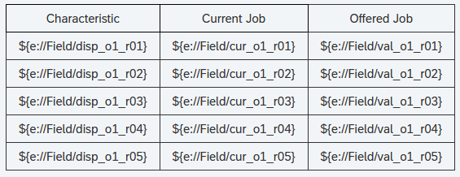

## PHP script for running conjoint experiments via Qualtrics

**Demo server: [https://jjacobs.info/handle_qualtrics.php](https://jjacobs.info/handle_qualtrics.php)**

**Demo survey implementation: [https://cumc.co1.qualtrics.com/jfe/form/SV_3WM8qu26hqannYW](https://cumc.co1.qualtrics.com/jfe/form/SV_3WM8qu26hqannYW)**

NOTE BEFORE ALL THIS: Qualtrics does an annoying thing with the data it collects, where if you change the wording of a question even a little bit after you've already published it, it treats all responses to the previously-worded version as in the "trash bin", so you have to do some work to go and re-include that data in the final dataset. Because of this, I highly recommend just duplicating the survey if you want to make a change, and calling the new one version 2, version 3, etc. (since the variables it generates when calling web services can be kind of dauntingly-named to begin with)

1. **Setting up the server** (The hard part) You'll need a PHP-enabled web server on which the .php script will live. For example, I just put it in the `public_html` subfolder of my home folder on the Textlab server, so that the URL to access it was https://textlab.econ.columbia.edu/~jjacobs/handle_qualtrics.php. If you don't have access to a server like this, there are ways to host .php scripts for free (like Heroku) that I'm happy to show yall.
2. **Specifying characteristics on the server side** Once the .php file is in a web-accessible folder, you'll need to modify the arrays at the top so that they contain the characteristics (the array keys) and the list of values for each characteristic (the array values). So if you have [categorical] characteristics A, B, and C, with values like a1, a2, a3, b1, b2, b3, and c1, c2, c3, the array at the top would look like:

    ```php
    $GLOBALS["characteristics"] = array(
        "A" => ["a1","a2","a3"],
        "B" => ["b1","b2","b3"],
        "C" => ["c1","c2","c3"]
    );
    ```
    (we use `$GLOBALS` instead of just a variable named `$characteristics` just so that all of the various functions can easily access the elements of this array)

    For non-categorical variables, if you want to generate randomly-sampled continuous values around the user-entered value, I have it set up to allow generating normally-distributed or [discrete or continuous] uniformly-distributed values (if you need something fancier just let me know). To specify those, for example if we wanted characteristic D to be generated via a normal distribution with variance 5 around the entered value, characteristic E to be generated via a discrete uniform distribution in the range +/- 3 units around the entered value, and characteristic F to be generated via a continuous uniform distribution in the range +/- 1 unit around the entered value, you'd add these as:

    ```php
    $GLOBALS["characteristics"] = array(
        "A" => ["a1","a2","a3"],
        "B" => ["b1","b2","b3"],
        "C" => ["c1","c2","c3"],
        "D" => ["NORM", 1, "$"],
        "E" => ["DISCRETE_UNIF", 3],
        "F" => ["CONTINUOUS_UNIF", 1]
    );
    ```
    Note also the third argument for characteristic "D": the "$" in the 3rd slot tells the server that you want the final value to be prepended with "$" (since we used this to generate hourly wage values).

    With this setup, then, the .php script would return `generated_D` (see below for the naming schema) sampled from a normal distribution with mean `entered_D` and variance 1, `generated_E` sampled from a discrete uniform distribution across [`entered_E` - 3, `entered_E` - 2, ..., `entered_E` + 2, `entered_E` + 3], and finally `generated_F` sampled from a continuous uniform distribution over (`entered_F` - 1, `entered_F` + 1).

    This is the main array you need to modify to suit your survey, but there are two others that you'll want to modify as well: first, the `table_display` array. In the code for the demo survey, this looks like:

    ```php
    $GLOBALS["table_display"] = array(
        "wage" => "Hourly Wage (USD)",
        "commute" => "Daily Commute",
        "numhrs" => "Hours Per Week",
        "healthcare" => "Healthcare Provided?",
        "lunch" => "Lunch Break Duration"
    );
    ```
    and this specifies the exact way you want the characteristics to be written (the row labels) in the conjoint table. The server still works if you don't specify this, but the table looks ugly since it just has the keys (like "numhrs") as row labels.

    Lastly, the `defaults` array. In the demo survey code this looks like

    ```php
    $GLOBALS["defaults"] = array(
        "wage" => 15.00,
        "commute" => "16-30 minutes",
        "numhrs" => 40,
        "healthcare" => "No",
        "lunch" => 10.00
    );
    ```
    and this gives the server default values to use in case one or more of the user-entered values isn't received for some reason (for example, if the user leaves a field blank). Since `wage` is generated via a normal distribution around the entered wage with variance 5, if the server doesn't receive an entered wage value it will instead just generate a wage via a normal distribution with mean 15.00 and variance 5.

    Once these arrays are set up, all that's left is stuff on the Qualtrics survey flow editor side.

3. **Naming the user-entered values in Qualtrics Flow Editor** The first step once you have the Qualtrics page open is to click "Flow" at the top of the survey editor. In this first Set Embedded Data block I'm just giving explicit names like `wm_entered_jobtitle` to the responses given to the survey questions up to that point, so that I can use these names across the remainder of the survey flow. This is the final product, but while setting this up it should provide you with menus that you can use to scroll through and select the correct question (e.g., the job title question here has id QID25, but I found that by just scrolling through the list of questions until I found the one that mentioned job title).

    

4. **Setting up the Web Service call in Qualtrics Flow Editor**: Next you'll need to create a Web Service call block and (importantly) specify every variable from the survey that you want to send to the .php script. In this case, I'm mostly just sending the variables I created in the previous step, though I also include `which_job = wm` since we had it set up to generate two different types of jobs (Walmart and non-Walmart), so that told the .php script which type to generate. *Important*: you'll need to make sure that the variables you send to the .php script (besides `which_job`, which you don't need to worry about sending) are all of the form `entered_<characteristic name>`, where `<characteristic name>` is one of the keys in the array at the top of the .php script (in the example from step 2, therefore, you'd need `entered_A`, `entered_B`, and `entered_C`)

    

5. **Telling Qualtrics how to handle the generated values**: Next, you'll need to specify what Qualtrics should call the variables it receives *back* from the .php script as a response. This part requires a bit of an in-depth explanation: we were randomizing absolutely everything, including the order in which the characteristics showed up (randomized row order), so the way it's set up now is there are just a ton of variables called `name_o1_r01`, `cur_o1_r01`, `val_o1_r01`; `name_o1_r02`, `cur_o1_r02`, `val_o1_r02`, and so on.

    * `name_o<N>_r<M>` stands for the *internal* name of the characteristic that, for offer `N`, should go in row `M`.
    * `disp_o<N>_r<M>` stands for the *display* name of that characteristic: the string that should actually be shown in the conjoint table (generated by the server using the `table_display` array described in step 2 above).
    * `cur_o<N>_r<M>` stands for the *current* value of that characteristic (the value entered by the respondent).
    * `val_o<N>_r<M>` stands for the *generated* value of that characteristic (the value created by the .php script).

    Since we had 6 job offers with 12 characteristics each, it was laborious, but in the end we had 4x6x12=288 different variables that the .php script returned, that we then assigned to Qualtrics variables using this schema:

    

    Note that while the `<varname>_o<N>_r<M>` variables are pretty unwieldy and not very human-readable, the server also generates human-readable variables like `generated_wage`, `generated_commute`, and so on, so you should also save these into Qualtrics embedded data fields like so:

    

    This will make your life much easier when downloading and analyzing the final dataset (see step 7 below).

6. **Displaying the generated values in a conjoint table**: Once you've finished this mapping from variables returned by the .php script to variables in Qualtrics, you can use them on any subsequent page! I'm also including the HTML code for the tables we generated here, in `table_code.html`, so you can see what that looks like, since it's a bit of a weird fusion of HTML code and Qualtrics-specific variable reference code. The table as it's set up there will look weird in the preview -- it will look like there are headers on both the left side and above each row -- but that's because it's set up to be responsive, meaning that if someone is viewing the survey on mobile it will auto-adjust the table setup so that they don't have to scroll left to right on their phone. (If you don't want to worry about the responsiveness, though, you can just make a basic standard HTML table) Notice that the notation `${e://Field/<variable name>}` just tells Qualtrics "replace this with whatever is in the embedded data field called `<variable name>`".

    

    (By the way, I have code that highlights all rows where the offered job value differs from the current job value, if that's useful. I just didn't include it here because it's kind of hackish/makes the code look more convoluted. Let me know if you want me to add this back in)

7. **Downloading the survey data at the end**: You should probably do some trial runs to make sure it works as intended, but once the full survey is launched and you have all the responses you need, when you go to download the final dataset from the Qualtrics interface it will have all of the variables you created (e.g., in the screenshots here, the dataset would have all of the `user_entered_<varname>`, `name_o<N>_r<M>`, `disp_o<N>_r<M>` `cur_o<N>_r<M>`,  `val_o<N>_r<M>`, and `generated_<varname>` values). However, since the `name`, `disp`, `cur`, and `val` variables were only generated to specify a randomized display order, you shouldn't need to include these in the analysis, so you can drop them and instead just use the simpler `generated_<varname>` values.