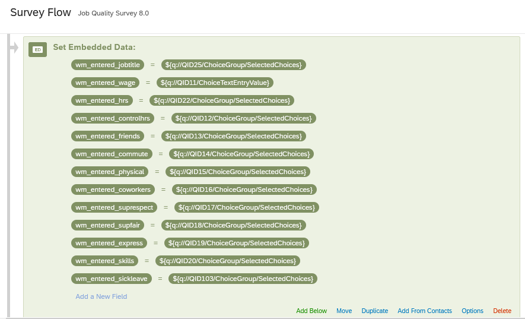
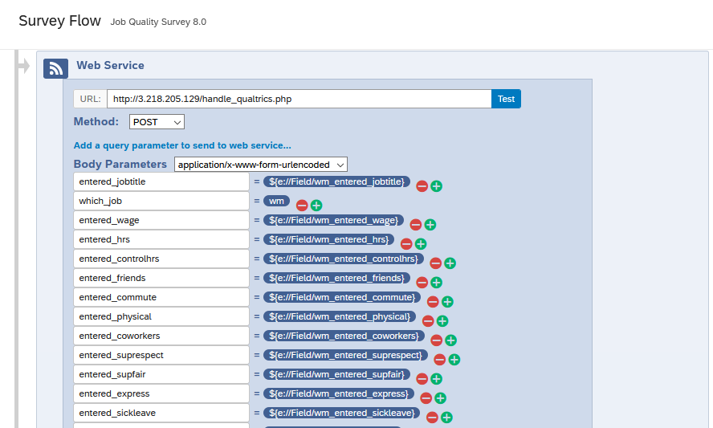
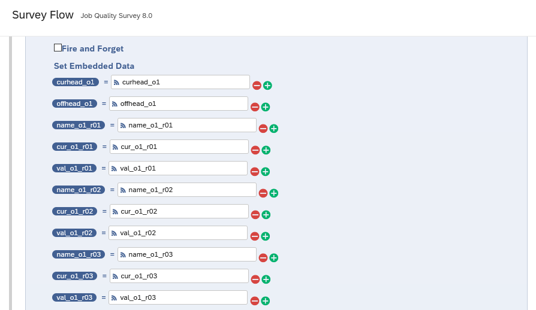
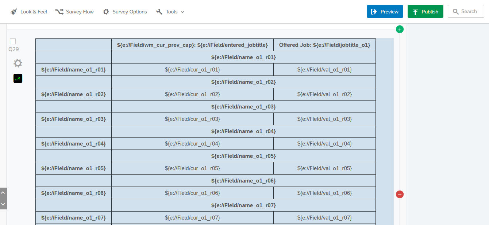

## PHP script for running conjoint experiments via Qualtrics

NOTE BEFORE ALL THIS: Qualtrics does an annoying thing with the data it collects, where if you change the wording of a question even a little bit after you've already published it, it treats all responses to the previously-worded version as in the "trash bin", so you have to do some work to go and re-include that data in the final dataset. Because of this, I highly recommend just duplicating the survey if you want to make a change, and calling the new one version 2, version 3, etc. (since the variables it generates when calling web services can be kind of dauntingly-named to begin with)

1. (The hard part) You'll need a PHP-enabled web server on which the .php script will live. For example, I just put it in the `public_html` subfolder of my home folder on the Textlab server, so that the URL to access it was https://textlab.econ.columbia.edu/~jjacobs/handle_qualtrics.php. If you don't have access to a server like this, there are ways to host .php scripts for free (like Heroku) that I'm happy to show yall.
2. Once the .php file is in a web-accessible folder, you'll need to modify the lists at the top so that they contain the characteristics (the array keys) and the list of values for each characteristic (the array values). So if you have characteristics A, B, and C, with values like a1, a2, a3, b1, b2, b3, and c1, c2, c3, the array at the top would look like:

    ```php
    characteristics = array(
        "A" => ["a1","a2","a3"],
        "B" => ["b1","b2","b3"],
        "C" => ["c1","c2","c3"]
    );
    ```

    If you want to generate randomly-sampled continuous values around the user-entered value, I have it set up to allow generating normally-distributed or uniformly-distributed values (if you need something fancier just let me know). To specify those, for example if we wanted characteristic D to be generated via a normal distribution with variance 1 around the entered value, and characteristic E to be generated via a uniform distribution in the range +/- 3 units around the entered value, you'd add these as:

    ```php
    characteristics = array(
        "A" => ["a1","a2","a3"],
        "B" => ["b1","b2","b3"],
        "C" => ["c1","c2","c3"],
        "D" => ["NORM", 1],
        "E" => ["UNIF", 3]
    );
    ```

    With this setup, then, the .php script would return `generated_D` (see below for the naming schema) sampled from a normal distribution with mean `entered_D` and variance 1, then `generated_E` sampled from a uniform distribution across (`entered_E` - 3, `entered_E` + 3).

    Once that array is set up, all that's left is stuff on the Qualtrics survey flow editor side.

3. The first step once you have the Qualtrics page open is to click "Flow" at the top of the survey editor. In this first Set Embedded Data block I'm just giving explicit names like `wm_entered_jobtitle` to the responses given to the survey questions up to that point, so that I can use these names across the remainder of the survey flow. This is the final product, but while setting this up it should provide you with menus that you can use to scroll through and select the correct question (e.g., the job title question here has id QID25, but I found that by just scrolling through the list of questions until I found the one that mentioned job title).

    

4. Next you'll need to create a Web Service call block and (importantly) specify every variable from the survey that you want to send to the .php script. In this case, I'm mostly just sending the variables I created in the previous step, though I also include `which_job = wm` since we had it set up to generate two different types of jobs (Walmart and non-Walmart), so that told the .php script which type to generate. *Important*: you'll need to make sure that the variables you send to the .php script (besides `which_job`, which you don't need to worry about sending) are all of the form `entered_<characteristic name>`, where `<characteristic name>` is one of the keys in the array at the top of the .php script (in the example from step 2, therefore, you'd need `entered_A`, `entered_B`, and `entered_C`)

    

5. Next, you'll need to specify what Qualtrics should call the variables it receives *back* from the .php script as a response. This part requires a bit of an in-depth explanation: we were randomizing absolutely everything, including the order in which the characteristics showed up (randomized row order), so the way it's set up now is there are just a ton of variables called `name_o1_r01`, `cur_o1_r01`, `val_o1_r01`; `name_o1_r02`, `cur_o1_r02`, `val_o1_r02`, and so on.

    * `name_o<N>_r<M>` stands for the name of the characteristic that, for offer `N`, should go in row `M`.
    * `cur_o<N>_r<M>` stands for the *current* value of that characteristic (the value entered by the respondent)
    * `val_o<N>_r<M>` stands for the *generated* value of that characteristic (the value created by the .php script)

    Since we had 6 job offers with 12 characteristics each, it was laborious, but in the end we had 6*12=72 different variables that the .php script returned, that we then assigned to Qualtrics variables using this schema:

    

6. Once you've finished this mapping from variables returned by the .php script to variables in Qualtrics, you can use them on any subsequent page! I'm also including the HTML code for the tables we generated here, in `table_code.html`, so you can see what that looks like, since it's a bit of a weird fusion of HTML code and Qualtrics-specific variable reference code. The table as it's set up there will look weird in the preview -- it will look like there are headers on both the left side and above each row -- but that's because it's set up to be responsive, meaning that if someone is viewing the survey on mobile it will auto-adjust the table setup so that they don't have to scroll left to right on their phone. (If you don't want to worry about the responsiveness, though, you can just make a basic standard HTML table) Notice that the notation `${e://Field/<variable name>}` just tells Qualtrics "replace this with whatever is in the embedded data field called `<variable name>`".

    